# Event-Driven Notification System

A Java-based event notification system implementing the Observer pattern with asynchronous processing.

## Architecture Layer Diagrams

### Complete System Overview
### View Layer


### Controller Layer


### Model Layer


### Service Layer


### Data Layer


### Cross-Layer Communication

```mermaid
graph TB
    subgraph "📱 View Layer"
        MC[MainController]
        UV[UserView]
        AV[AdminView]
    end
    
    subgraph "🎮 Controller Layer"
        EB[EventBus]
        PUB[Publisher]
    end
    
    subgraph "⚙️ Service Layer"
        NM[NotificationManager]
        ST[SpecificTime]
    end
    
    subgraph "📊 Model Layer"
        U[User]
        E[Event]
    end
    
    subgraph "💾 Data Layer"
        D[Data]
    end

    %% Cross-layer connections
    MC --> EB
    MC --> PUB
    UV --> EB
    AV --> PUB
    EB --> NM
    EB --> D
    U --> ST
    NM --> U
    NM --> E
```

```mermaid


## Features

- **Event-Driven Architecture**: Centralized event bus for publishers and subscribers
- **Asynchronous Processing**: Non-blocking notification delivery
- **User Management**: Login, registration, and role-based access (Admin/User)
- **Notification Preferences**: Configurable quiet hours and filtering
- **Professional Console UI**: Clean interface with ANSI colors

## Quick Start

```bash
# Clone and build
git clone <repository-url>
cd EventDrivenNotificationSystem
mvn clean compile

# Run application
mvn exec:java -Dexec.mainClass="org.example.Main"

# Run tests
mvn test
```

## Default Test Accounts

| Role | Email | Password |
|------|--------|----------|
| Admin | `admin@system.com` | `admin123` |
| User | `user@system.com` | `user123` |
| Demo | `demo@system.com` | `demo123` |

## Design Patterns

- **Observer Pattern**: EventBus manages publisher-subscriber relationships
- **MVC Pattern**: Separation of Models, Views, and Controllers
- **Strategy Pattern**: IPreference interface for different notification preferences
- **Singleton Pattern**: Static NotificationManager for centralized notification handling

## Architecture

```
org.example/
├── Controller/     # EventBus, Publisher, Schedule
├── Models/        # Event, User
├── Services/      # NotificationManager, Preferences
├── View/          # UI components and controllers
└── Data/          # In-memory storage
```

## Key Component Interactions

### Observer Pattern Flow
1. **EventBus** acts as the central hub managing all observers (Users)
2. **Publisher** creates events and sends them to EventBus
3. **EventBus** notifies all subscribed Users about relevant events
4. **NotificationManager** processes notifications based on user preferences

### User Preference System
- **IPreference** interface allows different notification strategies
- **DefaultPreference** for regular users with muting and quiet hours
- **AdminPreference** for administrators with priority notifications
- **TimeRange** utility for quiet hours functionality

### Data Flow
1. Admin creates event via **ConsoleUI**
2. **Publisher** publishes event to **EventBus**
3. **EventBus** notifies subscribed **Users**
4. **NotificationManager** applies user **Preferences**
5. Notifications delivered based on user settings

## Testing

- **Unit Tests**: Core business logic with JUnit 5
- **Mock Testing**: Mockito for dependencies and external calls
- **Integration Tests**: Event flow and notification delivery
- **Coverage**: EventBus, Publisher, and Schedule components

```bash
# Run all tests
mvn test

# Run specific test
mvn test -Dtest=EventBusTest
```

## Requirements

- Java 17+
- Maven 3.6+
- 512MB RAM minimum

## Key Usage

1. **Login/Register** → Choose user type (Admin/Regular)
2. **Subscribe to Events** → Select from available event types
3. **Configure Preferences** → Set quiet hours for notifications
4. **Admin Features** → Create and publish events to all subscribers
